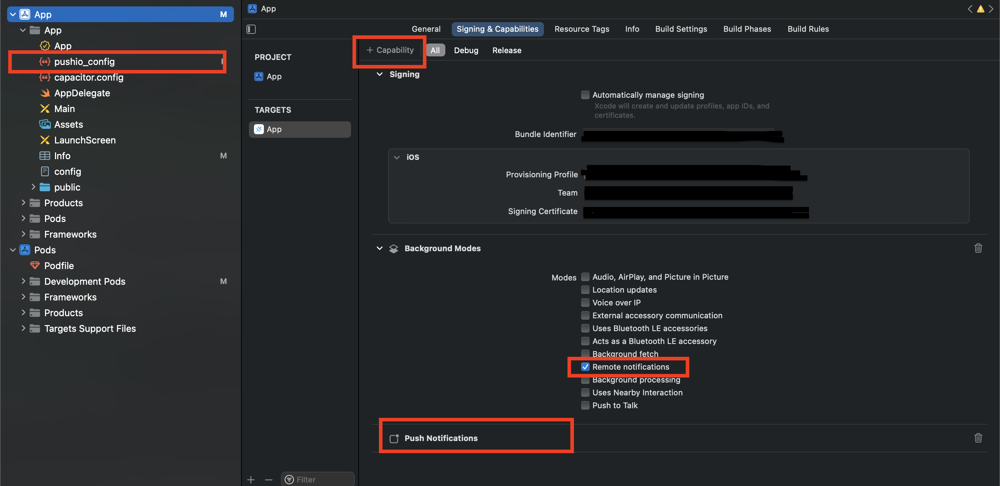

## Capacitor Plugin for Responsys SDK

This plugin makes it easy to integrate your Capacitor based mobile app with the Responsys SDK. 

### Table of Contents
- [Requirements](#requirements)
  * [For Android](#for-android)
  * [For iOS](#for-iOS)
- [Setup](#setup)
  * [For Android](#for-android-1)
  * [For iOS](#for-iOS-1)
- [Installation](#installation)
- [Integration](#integration)
  * [For Android](#for-android-2)
  * [For iOS](#for-iOS-2)
- [Usage](#usage)
  * [Configure And Register](#configure-and-register)
  * [User Identification](#user-identification)
  * [Engagements And Conversion](#engagements-and-conversion)
  * [In-App Messages](#in-app-messages)
  * [Message Center](#message-center)
  * [Geofences And Beacons](#geofences-and-beacons)
  * [Notification Preferences](#notification-preferences)
  * [Handling Deeplinks](#Handling Deeplinks)
- [Support](#support)
- [License](#license)


### Requirements

- Capacitor CLI >= 4.0.0

#### For Android
- Android SDK Tools >= 26.1.1
- Capacitor Android >= 4.0.0 

#### For iOS
- iOS 14 or later
- Capacitor iOS >= 4.0.0 

### Setup

Before installing the plugin, you must setup your app to receive push notifications.

#### For Android
- [Get FCM Credentials](https://docs.oracle.com/en/cloud/saas/marketing/responsys-develop-mobile/android/gcm-credentials) 
- Log in to the [Responsys Mobile App Developer Console](https://docs.oracle.com/en/cloud/saas/marketing/responsys-develop-mobile/dev-console/login/) and enter your FCM credentials (Project ID and Server API Key) for your Android app.
- Download the `pushio_config.json` file generated from your credentials and include it in your project's `platforms/android/src/main/assets` folder.
- Copy `PushIOManager-6.53.aar`  and place it in the project's `android/src/main/libs` folder. 


#### For iOS
- [Generate Auth Key](https://docs.oracle.com/en/cloud/saas/marketing/responsys-develop-mobile/ios/auth-key/) 
- Log in to the [Responsys Mobile App Developer Console](https://docs.oracle.com/en/cloud/saas/marketing/responsys-develop-mobile/dev-console/login/) and enter your Auth Key and other details for your iOS app.
- Download the `pushio_config.json` file generated from your credentials.
- Open the Xcode project workspace in your `ios` directory of Capacitor app. 
- Drag and Drop your `pushio_config.json` in Xcode project.
- Select the root project and Under Capabilites add the "Push Notifications" and "Background Modes". 

- Download `PushIOManager.xcframework` from [here](https://www.oracle.com/downloads/applications/cx/responsys-mobile-sdk.html) and copy to frameworks `PushIOManager.xcframework` from  and place it in the plugin `PATH_TO_pushiomanager-Capacitor-plugin_DIRECTORY/frameworks/` folder before adding plugin to project. 


### Installation

Download the plugin,
```shell
git clone https://github.com/pundixit/capacitor-pushiomanager
```

### For Android
- Create a new directory  - `PushIOManager` inside your app's `android` directory.
- Download the SDK native binary from [here](https://www.oracle.com/downloads/applications/cx/responsys-mobile-sdk.html) and place the .aar file in this `android/PushIOManager/` directory.
- Inside the `android/PushIOManager` directory, create a file `build.gradle` with the following code:

	```gradle
	configurations.maybeCreate("default")
	artifacts.add("default", file('PushIOManager-6.53.1.aar'))
	```		

- Add the following to your project-wide `settings.gradle` file:

	```gradle
	include ':PushIOManager'
	project(':PushIOManager').projectDir = new File(rootProject.projectDir, './PushIOManager')
	```

### For iOS 
- Copy `PushIOManager.xcframework`  and place it in the plugin  `PATH_TO_Capacitor-plugin-pushiomanager_DIRECTORY/frameworks/` folder before adding plugin to project. 


The plugin can be installed with the Capacitor CLI,

```shell
npm install PATH_TO_pushiomanager-Capacitor-plugin_DIRECTORY

npm cap sync
```


### Integration

#### For Android

- Open the `AndroidManifest.xml` file located at `platforms/android/src/main` and add the following,
	* Permissions above the `<application>` tag,

		```xml
		<uses-permission android:name="android.permission.ACCESS_FINE_LOCATION" />
		<uses-permission android:name="${applicationId}.permission.PUSHIO_MESSAGE" />
		<uses-permission android:name="${applicationId}.permission.RSYS_SHOW_IAM" />
		<permission android:name=".permission.PUSHIO_MESSAGE" android:protectionLevel="signature" />
		<permission android:name="${applicationId}.permission.RSYS_SHOW_IAM" android:protectionLevel="signature" />
		```
	
	* Intent-filter for launching app when the user taps on a push notification. Add it inside the `<activity>` tag of `MainActivity`,

		```xml
		<intent-filter>
			<action android:name="${applicationId}.NOTIFICATIONPRESSED" />
	   		<category android:name="android.intent.category.DEFAULT" />
		</intent-filter>
		```

	* (Optional) Intent-filter for [Android App Links](https://developer.android.com/training/app-links) setup. Add it inside the `<activity>` tag of `MainActivity`,

		```xml
		<intent-filter android:autoVerify="true">
			<action android:name="android.intent.action.VIEW" />
			<category android:name="android.intent.category.DEFAULT" />
			<category android:name="android.intent.category.BROWSABLE" />
			<data android:host="@string/app_links_url_host" android:pathPrefix="/pub/acc" android:scheme="https" />
       </intent-filter>
		```
		
	* Add the following code inside `<application>` tag,

		```xml
		 <receiver android:enabled="true" android:exported="false" android:name="com.pushio.manager.PushIOUriReceiver" tools:node="replace">
            <intent-filter>
                <action android:name="android.intent.action.VIEW" />
                <category android:name="android.intent.category.DEFAULT" />
                <data android:scheme="@string/uri_identifier" />
            </intent-filter>
        </receiver>
        <activity android:name="com.pushio.manager.iam.ui.PushIOMessageViewActivity" android:permission="${applicationId}.permission.SHOW_IAM" android:theme="@android:style/Theme.Translucent.NoTitleBar">
            <intent-filter tools:ignore="AppLinkUrlError">
                <action android:name="android.intent.action.VIEW" />
                <category android:name="android.intent.category.BROWSABLE" />
                <category android:name="android.intent.category.DEFAULT" />
                <data android:scheme="@string/uri_identifier" />
            </intent-filter>
        </activity>
		```
		

- Open the `strings.xml` file located at `platforms/android/src/main/res/values` and add the following properties,

	* Custom URI scheme for displaying In-App Messages and Rich Push content,

		```xml
		<string name="uri_identifier">pio-YOUR_API_KEY</string>
		```
		You can find the API key in the `pushio_config.json` that was placed in `platforms/android/app/src/main/assets` earlier during setup.
		
	* (Optional) If you added the `<intent-filter>` for Android App Links in the steps above, then you will need to declare the domain name,
	
		```xml
		<string name="app_links_url_host">YOUR_ANDROID_APP_LINKS_DOMAIN</string>
		```


#### For iOS

Add below code in `AppDelegate.swift`

```
func application(_ application: UIApplication, didRegisterForRemoteNotificationsWithDeviceToken deviceToken: Data) {
  		NotificationCenter.default.post(name: .capacitorDidRegisterForRemoteNotifications, object: deviceToken)
}
   
        
func application(_ application: UIApplication, didFailToRegisterForRemoteNotificationsWithError error: Error) {
	NotificationCenter.default.post(name: .capacitorDidFailToRegisterForRemoteNotifications, object: error)
}
  
  
func application(_ app: UIApplication, open url: URL, options: [UIApplication.OpenURLOptionsKey: Any] = [:]) -> Bool {
  
    return ApplicationDelegateProxy.shared.application(app, open: url, options: options)
  }
  
func application(_ application: UIApplication, continue userActivity: NSUserActivity, restorationHandler: @escaping ([UIUserActivityRestoring]?) -> Void) -> Bool {
   return ApplicationDelegateProxy.shared.application(application, continue: userActivity, restorationHandler: restorationHandler)
  }
```

- For In-App Messages and Rich Push Content follow the below steps :
  * To Enable Custom URI scheme for displaying In-App Messages and Rich Push content follow the [Step 1](https://docs.oracle.com/en/cloud/saas/marketing/responsys-develop-mobile/ios/in-app-msg/). You don't need to add the code.
  You can find the API key in the `pushio_config.json` that was placed in your Xcode project earlier during setup.
  
  * Follow  [Step 2](https://docs.oracle.com/en/cloud/saas/marketing/responsys-develop-mobile/ios/in-app-msg/) to  add the reuired capabilites in your Xcode project for In-App messages. You don't need to add the code.

- For Media Attachments you can follow the following [guide](https://docs.oracle.com/en/cloud/saas/marketing/responsys-develop-mobile/ios/media-attachments/). Copy and paste the code provided in guide in respective files.	

- For Carousel Push you can follow the following [guide](https://docs.oracle.com/en/cloud/saas/marketing/responsys-develop-mobile/ios/carousel-push/). Copy and paste the code provided in guide in respective files.    

### Usage

The plugin can be accessed in JS code using the namespace `PushIOManager`. The following code samples use  `PushIOManager` for the namespace.

#### Configure And Register

- Configure the SDK,

	```javascript
	PushIOManager.configure({filename:"pushio_config.json"}).then((response) => {
		if (response.success) {
	      console.log("SDK configured successfully");
	      
		} else if (response.error){
		  console.log("Sdk configuration failed" + error);
		}
	      
	}).catch(error => {
     console.log("SDK configuration failed" + error);
   });
	```
	
- Once the SDK is configured, register the app with Responsys,

	```javascript
	PushIOManager.registerApp({useLocation:true}).then( (response) => {
	
		if (response.success) {
	
	      console.log("App registered successfully");
	      
		} else if (response.error){
			  console.log("registerApp successfully");
		}
	      
	}).catch(error => {
       console.log("RegisterApp failed" + error);
   });
	```
	

#### User Identification

- Associate an app installation with a user (usually after login),

	```javascript
	PushIOManager.registerUserId({userID:"xyz@yxz.zyx"}).then((response) => {
	
		if (response.success) {
	     // success
	      
		} else if (response.error){
		  // error
		}
	      
	}).catch(error => {
       console.log("error" + error);
   });
   	```
	
- When the user logs out,

	```javascript
	PushIOManager.unregisterUserId().then((response) => {
	
		if (response.success) {
	
	      
		} else if (response.error){
		
		}
	      
	}).catch(error => {
       console.log("error" + error);
   });
	```
	

#### Engagements And Conversion

User actions can be attributed to a push notification using,

```javascript
PushIOManager.trackEngagement({eventName:PushIOManager.engagementType.PUSHIO_ENGAGEMENT_METRIC_INAPP_PURCHASE}).then((response) => {
	
		if (response.success) {
	
	      
		} else if (response.error){
		
		}
	      
	}).catch(error => {
       console.log("error" + error);
   });
```

#### In-App Messages

In-App Message (IAM) are displayed in a popup window via system-defined triggers like `$ExplicitAppOpen` or custom triggers. IAM that use system-defined triggers are displayed automatically.

IAM can also be displayed on-demand using custom triggers.

- Your marketing team defines a custom trigger in Responsys system and shares the trigger-event name with you.
- Marketer launches the campaign and the IAM is delivered to the device via push or pull mechanism (depending on your Responsys Account settings)
- When you wish to display the IAM popup, use,

	```javascript
	PushIOManager.trackEvent({eventName:custom_event_name, properties:properties}).then((response) => {
	
		if (response.success) {
	
	      
		} else if (response.error){
		
		}
	      
	}).catch(error => {
       console.log("error" + error);
   });
	```


#### Message Center

- Get the Message Center messages list using,

	```javascript
	PushIOManager.fetchMessagesForMessageCenter({messageCenter:name}).then( (response) => {
     
     
      if (response.messages && response.messages.length > 0) {
       
      } else {
        
      }

    }).catch(error => {
       console.log("error" + error);
   });
	```
	
- If any message has a rich-content (HTML) then call,

	```javascript
	PushIOManager.fetchRichContentForMessage({messageID:messageID}).then( (response) => {
	
	      // `response` is the HTML content
}).catch(error => {
       console.log("error" + error);
   });
	```
	
	Remember to store these messages, since the SDK cache is purgeable.
	

#### Geofences And Beacons

If your app is setup to monitor geofence and beacons, you can use the following APIs to record in Responsys when a user enters/exits a geofence/beacon zone.

```javascript
PushIOManager.onGeoRegionEntered({region:geoRegion}).then( (response) => {});
PushIOManager.onGeoRegionExited({region:geoRegion}).then( (response) => {});
PushIOManager.onBeaconRegionEntered({region:beaconRegion}).then((response) => {});
PushIOManager.onBeaconRegionExited({region:beaconRegion}).then( (response) => {});
```


#### Notification Preferences

Preferences are used to record user-choices for push notifications. The preferences should be [pre-defined in Responsys](https://docs.oracle.com/en/cloud/saas/marketing/responsys-develop-mobile/dev-console/app-design/#notification-preferences) before being used in your app.

- Declare the preference beforehand in the app,

	```javascript
	PushIOManager.declarePreference(key, label, preferenceType, (response) => {
	
	}, (error) => {
	      
	}).catch(error => {
       console.log("error" + error);
   });
	```

- Once a preference is declared successfully, you may save the preference using,

	```javascript
	PushIOManager.setPreference(key, value, (response) => {
	
	}, (error) => {
	      
	}).catch(error => {
       console.log("error" + error);
   });
	```
	
Do not use this as a key/value store as this data is purgeable.

#### Handling Deeplinks

When the user taps on a push notification (having a deeplink), the plugin passes the deeplink to the app.


Add **interceptOpenURL:true** in capacitor.config.js file of App

```
"plugins":{
		"PushIOManager": {
			"interceptOpenURL": true
		}
	}

```

App must implement the following listener to handle deeplinks.

```
PushIOManager.addListener('setInterceptOpenURL', (response) => {
           console.log('Deep link url' + response["url"]);
 
  });
```

### Support

If you have access to My Oracle Support, please raise a request [here](http://support.oracle.com/), otherwise open an issue in this repository. 


### License

Copyright (c) 2022 Oracle and/or its affiliates and released under the Universal Permissive License (UPL), Version 1.0.

Oracle and Java are registered trademarks of Oracle and/or its affiliates. Other names may be trademarks of their respective owners.
